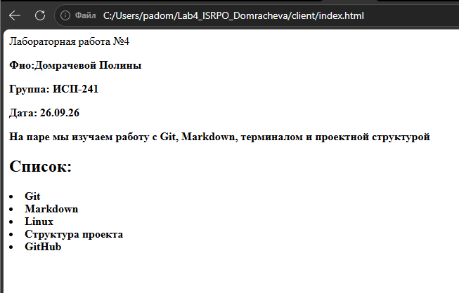
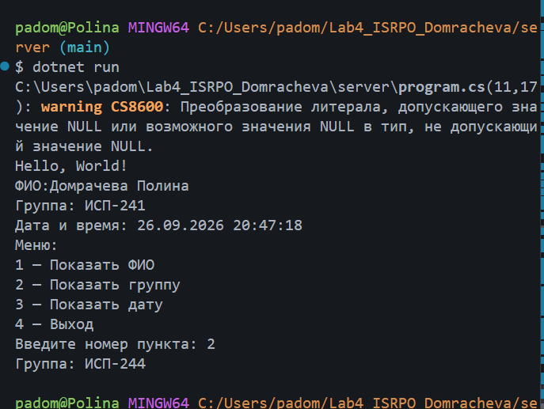
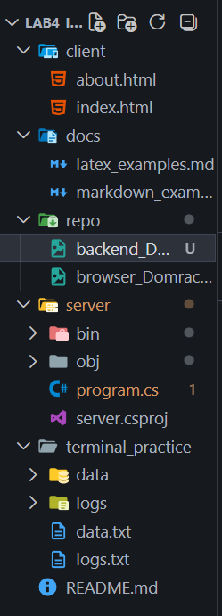
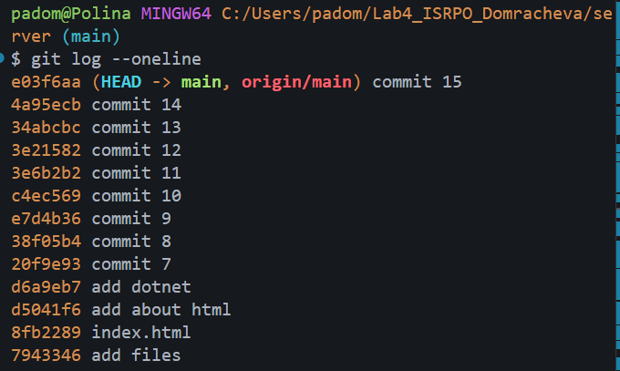

# Лабораторная работа №4

**ФИО:** Домрачевой Полины 
**Группа:** ИСП-241
**Дата:** 26.09.26

## Описание проекта
Проект демонстрирует навыки работы с Git, Markdown, терминалом и структурой проекта.

## Содержание
- [Структура проекта](#структура-проекта)
- [Примеры Markdown](#примеры-markdown)
- [LaTeX](#latex)
- [Ссылки](#ссылки)
- [Скриншоты](#скриншоты)
- [Заключение](#заключение)

## Структура проекта
- `client/`
  - `index.html`
  - `about.html`
- `docs/`
  - `latex_examples.md`
  - `markdown_examples.md`
- `repo/`
  - `browser_Domracheva.png`
  - `backend_Domracheva.png`
  - `terminal_Domracheva.png`
  - `git_Domracheva.png`
- `server/`
  - `program.cs`
- `terminal_practice/`
  - `data.txt`
  - `logs.txt`
- `README.md`
## Примеры Markdown

### Заголовок

- Список 1
- Список 2


```bash
git status
```
## Пример LaTeX
Inline: 
$a^2 + b^2 = c^2$
Block: 
$$
\sum_{i=1}^n i = \frac{n(n+1)}{2}
$$

## Ссылка на репозиторий
[GitHub](https://github.com/chipollina/Lab4_ISRPO_Domracheva.git)

## Скриншоты из папки repo





## Заключение 
В ходе работы были закреплены навыки работы с Git, Markdown, терминалом и структурой проекта.
___